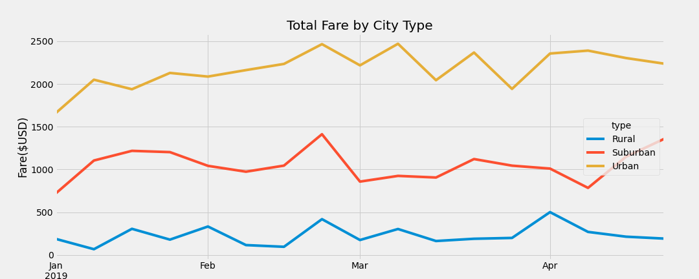
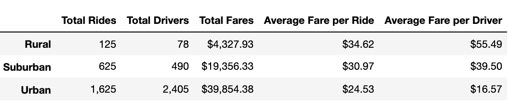
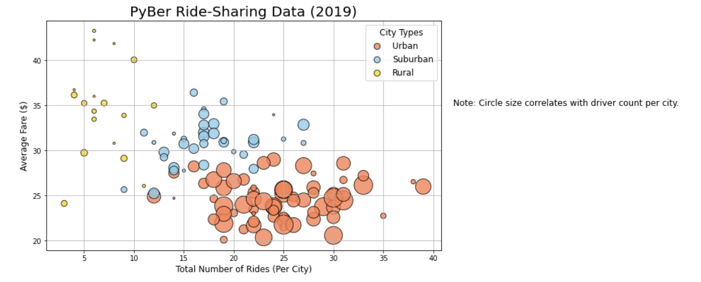
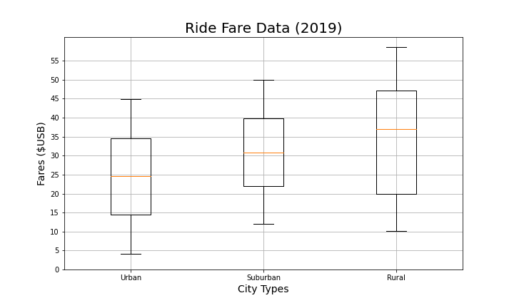

# PyBer Analysis

## Overview

This analysis was developed to display how the 2019 data for ride share service PyBer differs by city type and how those differences can be used by decision-makers at PyBer. Steps included: exploratory analysis of the data, and creating compelling visualizations to help tell the story of how people are using this service. Reviewing information by type of city, and user/driver information over time will help PyBer leaders make informed decisions about access and affordability for underserved markets.

## Results

There is a description of the differences in ride-sharing data among the different city types. 

Ride-sharing conclusions include 
* the total rides was much higher for urban cities than for rural cities.
* total drivers was very low in rural cities compared to either suburban or urban cities.
* total fares for 2019 PyBer riders were more numerous in urban cities, and more expensive in rural cities.
* average fare per ride in an urban city was $24.53, and most rides were shorter and less expensive than thet rides in rural areas.
* average fare per driver was highest in rural cities, although there were much fewer fares per driver in those areas.
* total fare by city type varied significantly, in that rural cities total fares were about 10x less than the fares of urban cities. Suburban cities had a total fare amountt for 2019 that was about half that of urban cities.

## Summary:

Recommendations for addressing disparities in service and potential new markets are: promote special longer trips to riders in rural and suburban areas as a special campaign to get those riders into spaces with more PyBer drivers more frequently; promote driver programs in rural and suburban areas to get more people aware of an interested in being available to riders; have drivers in rural and suburban areas deliver goods as well as riders, so that they can get paid for more trips even if people do not want to ride to get goods themselves.
